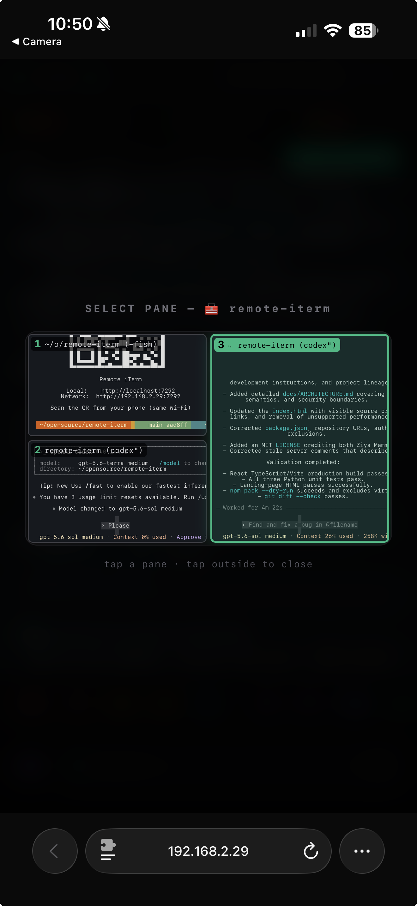
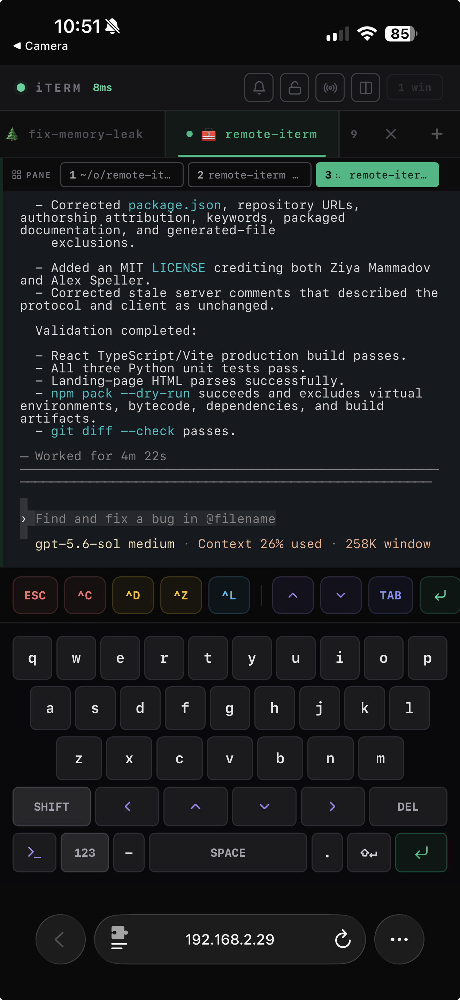

# remote-iterm

Control macOS iTerm2 from a phone on your local network.

> [!IMPORTANT]
> This project began as a fork of [Ziya Mammadov's `mammadovziya/remote-iterm`](https://github.com/mammadovziya/remote-iterm). That project supplied the original idea, mobile interface, CLI packaging, and feature foundation. This fork is now a substantial rewrite, but it would not exist without Ziya's work.

The current fork replaces the original Node.js/AppleScript server with an event-driven Python service built on iTerm2's native API. It also extends the mobile client with first-class split-pane navigation, live pane previews, faithful terminal colors and cursor rendering, and terminal-correct key input.

<p align="center">
  
  
</p>

## Install this fork

Install directly from this repository:

```bash
npm install -g github:alexspeller/remote-iterm
```

The unqualified `npm install -g remote-iterm` package belongs to the upstream project and may not contain this fork's rewrite.

## Usage

```bash
remote-iterm          # start
remote-iterm stop     # stop
remote-iterm restart  # restart
```

The launcher prints local and network URLs and a QR code. Open the network URL on a phone connected to the same Wi-Fi network.

On first launch, iTerm2 asks for one-time Automation permission so the Python API can connect. Approve it when prompted.

> [!WARNING]
> remote-iterm protects terminal access with a machine-stable shared key generated on first launch. It still uses unencrypted HTTP and WebSocket traffic: a network observer could capture the key and terminal data. Prefer a trusted local network or VPN, never forward its ports to the internet, and stop it when you are finished.

## What changed in this fork

### Native, event-driven iTerm2 integration

- Replaced the Node.js/Express and `osascript` backend with Python, `asyncio`, `aiohttp`, and the native iTerm2 Python API.
- Replaced 150 ms content polling and repeated subprocess creation with iTerm2 screen streams for the sessions clients are actually watching.
- Coalesces fast output and uses bounded, latest-wins delivery per phone, so a sleeping or slow client cannot accumulate an unlimited terminal-output backlog.
- Uses iTerm2 layout and focus notifications for responsive state updates, with a deduplicated low-frequency refresh only for changes the API does not notify about.
- Uses stable iTerm2 session GUIDs and addresses panes directly, including panes that are not focused on the Mac.

### Better terminal fidelity

- Renders terminal output as styled cells instead of plain text.
- Resolves default and ANSI colors against each session's active iTerm2 profile, including light/dark variants and xterm 256-color values.
- Preserves foreground color, background color, bold, faint, inverse video, and the visible terminal cursor.
- Sends control bytes, escape sequences, and carriage return directly to the session, so quick keys and Return behave correctly in shells and raw-mode TUIs.

### First-class panes and mobile controls

- Discovers every pane in a tab, including minimized panes when one pane is maximized.
- Reconstructs nested iTerm2 split geometry and provides a spatial pane map with live terminal previews.
- Can display and independently control two sessions at once, in a horizontal or vertical mobile split.
- Adds a multi-layer virtual keyboard with staggered letter rows, symbols, arrows, modifiers, and terminal shortcuts.

### More robust lifecycle

- Creates and updates an isolated Python virtual environment automatically.
- Tracks both the backend and Vite processes and can recover from stale PID files by checking the listening ports.
- Runs Python as a background-only process on macOS and refuses to silently start Vite on an unexpected fallback port.
- Starts with a scannable QR code and keeps the existing `start`, `stop`, and `restart` CLI workflow.
- Adds focused unit coverage for styled output, cursor placement, scrollback paging, and bounded client delivery.

For the component model, data flow, Socket.IO contract, and design trade-offs, see [Architecture](docs/ARCHITECTURE.md).

## Features

- Live terminal output with profile-aware ANSI and true-color rendering
- Bounded live delivery that remains safe when a phone sleeps or its connection stalls
- Machine-stable shared-key authentication through QR and bookmarked URLs
- Visible cursor, bold, faint, inverse, and background styles
- Tab creation, closing, selection, and long-press rename
- Horizontal tab strips with a touch-friendly vertical tab picker
- Spatial split-pane switcher with live previews
- Two-session view with an adjustable divider and independent focus
- Multi-window spatial map
- Broadcast commands to selected windows
- Persistent command history with arrow navigation
- Virtual keyboard and raw terminal keys
- Quick actions such as Ctrl+C, Escape, arrows, and Tab
- Clipboard paste and terminal-output copy
- Landscape layout and iPhone safe-area handling
- Connection latency indicator and automatic reconnect
- Screen wake lock, scroll lock, and optional completion vibration
- Installable PWA

## Requirements

- macOS with iTerm2
- iTerm2 **Python API enabled** under **Settings → General → Magic → Enable Python API**
- Python 3.8 or newer (Homebrew `python3` is recommended; the launcher creates its own virtual environment)
- Node.js 18 or newer (used to serve the Vite client)
- A phone and Mac on the same trusted Wi-Fi network

## Run from source

```bash
git clone https://github.com/alexspeller/remote-iterm.git
cd remote-iterm
npm install
./iterm-server
```

The first launch creates `server/.venv`, installs the Python dependencies, and generates a private shared access key. The QR code and printed URLs include that key in the URL fragment, so the page can be bookmarked without sending the key in the initial HTTP request. Later launches reuse the same key and reinstall dependencies only when `server/requirements.txt` changes.

## Development and tests

This repository uses `mise` when a tool configuration is available:

```bash
mise exec -- npm install
mise exec -- npm --prefix client run build

# After ./iterm-server has created server/.venv
mise exec -- server/.venv/bin/python -m unittest server/test_server.py
```

The backend requires a running iTerm2 instance and permission to use its Python API for integration testing. The client build and isolated rendering tests do not require a phone.

## Ports and local files

- `7291` — Python Socket.IO server
- `7292` — Vite web client
- `.iterm-server.pid` — backend and client process IDs
- `.iterm-server.log` — combined server and client log
- `server/.venv` — automatically managed Python environment
- `~/Library/Application Support/remote-iterm/access-key` — generated shared key (`0600` permissions)

## Project lineage

The upstream project is [`mammadovziya/remote-iterm`](https://github.com/mammadovziya/remote-iterm), created by [Ziya Mammadov](https://github.com/mammadovziya). The rewrite is maintained in [`alexspeller/remote-iterm`](https://github.com/alexspeller/remote-iterm). Git history has been retained so the original work and subsequent changes remain attributable.

## License

MIT. See [LICENSE](LICENSE).
