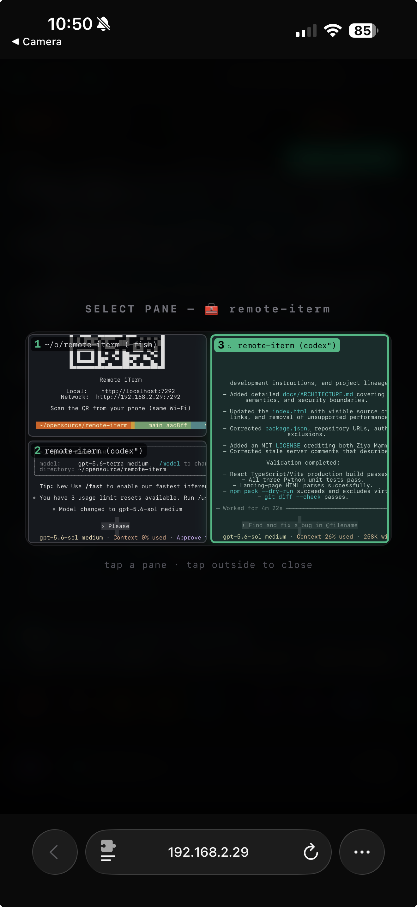

# remote-iterm

Control macOS iTerm2 from a phone on your local network.

> [!IMPORTANT]
> This project began as a fork of [Ziya Mammadov's `mammadovziya/remote-iterm`](https://github.com/mammadovziya/remote-iterm). That project supplied the original idea, mobile interface, CLI packaging, and feature foundation. This fork is now a substantial rewrite, but it would not exist without Ziya's work.

The current fork replaces the original Node.js/AppleScript server with an event-driven Python service built on iTerm2's native API. It also extends the mobile client with first-class split-pane navigation, live pane previews, faithful terminal colors and cursor rendering, and terminal-correct key input.

<p align="center">
  
</p>

## Install this fork

Install directly from this repository:

```bash
npm install -g github:alexspeller/remote-iterm
```

The unqualified `npm install -g remote-iterm` package belongs to the upstream project and may not contain this fork's rewrite.

## Usage

```bash
remote-iterm          # start
remote-iterm stop     # stop
remote-iterm restart  # restart
remote-iterm url      # print the URLs and QR code again
```

The launcher prints local and network URLs and a QR code. Open the network URL on a phone connected to the same Wi-Fi network.

On first launch, iTerm2 asks for one-time Automation permission so the Python API can connect. Approve it when prompted.

> [!WARNING]
> remote-iterm protects terminal access with a machine-stable shared key generated on first launch. It still uses unencrypted HTTP and WebSocket traffic: a network observer could capture the key and terminal data. Prefer a trusted local network or VPN, never forward its ports to the internet, and stop it when you are finished.

## What changed in this fork

### Native, event-driven iTerm2 integration

- Replaced the Node.js/Express and `osascript` backend with Python, `asyncio`, `aiohttp`, and the native iTerm2 Python API.
- Replaced 150 ms content polling and repeated subprocess creation with iTerm2 screen streams for the sessions clients are actually watching.
- Coalesces fast output and uses bounded, latest-wins delivery per phone, so a sleeping or slow client cannot accumulate an unlimited terminal-output backlog.
- Uses iTerm2 layout and focus notifications for responsive state updates, with a deduplicated low-frequency refresh only for changes the API does not notify about.
- Uses stable iTerm2 session GUIDs and addresses panes directly, including panes that are not focused on the Mac.

### Better terminal fidelity

- Renders terminal output as styled cells instead of plain text.
- Resolves default and ANSI colors against each session's active iTerm2 profile, including light/dark variants and xterm 256-color values.
- Preserves foreground color, background color, bold, faint, inverse video, and the visible terminal cursor.
- Sends control bytes, escape sequences, and carriage return directly to the session, so quick keys and Return behave correctly in shells and raw-mode TUIs.

### First-class panes and mobile controls

- Discovers every pane in a tab, including minimized panes when one pane is maximized.
- Reconstructs nested iTerm2 split geometry and provides a spatial pane map with live terminal previews.
- Can display and independently control two sessions at once, in a horizontal or vertical mobile split.
- Offers native mobile-keyboard input that can send text, Delete, Return, Tab, Escape, and arrows directly to the terminal as they are typed.

### More robust lifecycle

- Creates and updates an isolated Python virtual environment automatically.
- Tracks the backend, client, and snapshotter processes and can recover from stale PID files by checking the listening ports.
- Serves a production build of the client rather than the Vite dev server, so nothing reloads the page from under the user; the build is refreshed on start whenever the client sources changed.
- Runs Python as a background-only process on macOS and refuses to silently serve the client on an unexpected fallback port.
- Starts with a scannable QR code and keeps the existing `start`, `stop`, and `restart` CLI workflow.
- Adds focused unit coverage for styled output, cursor placement, scrollback paging, and bounded client delivery.

For the component model, data flow, Socket.IO contract, and design trade-offs, see [Architecture](docs/ARCHITECTURE.md).

## Features

- Live terminal output with profile-aware ANSI and true-color rendering
- Bounded live delivery that remains safe when a phone sleeps or its connection stalls
- Machine-stable shared-key authentication through QR and bookmarked URLs, kept alive by an HttpOnly cookie so a phone that only ever arrives via notification links keeps working
- Notification deep links: `#session=<iTerm session id>` opens that pane and focuses it on the Mac
- Visible cursor, bold, faint, inverse, and background styles
- Tappable links: any printed web address (joined across wrapped rows), with `localhost` addresses pointed back at the Mac; OSC 8 hyperlinks are handled too, but iTerm2's API does not export them yet (see [Architecture](docs/ARCHITECTURE.md#links-and-text-selection))
- Selectable terminal text; live updates for a pane pause while a finger is on it or text in it is selected
- Tab creation, closing, selection, and long-press rename
- Horizontal tab strips with a touch-friendly vertical tab picker
- Spatial split-pane switcher with live previews
- Two-session view with an adjustable divider and independent focus
- Multi-window spatial map
- Broadcast commands to selected windows
- Persistent command history with arrow navigation, and an unsent command that survives a reload
- Native keyboard direct-input mode and raw terminal keys
- Quick actions such as Ctrl+C, Escape, arrows, and Tab
- Clipboard paste and terminal-output copy
- Landscape layout and iPhone safe-area handling
- Connection latency indicator and instant, quiet automatic reconnect (a banner only if the outage outlasts a couple of seconds)
- Screen wake lock, scroll lock, and optional completion vibration
- Installable PWA
- Continuous state snapshots for crash recovery, with an ASCII layout map and one-command restore

## State snapshots & crash recovery

remote-iterm continuously records your full iTerm2 layout so you can recover it after a crash or accidental quit. An independent snapshotter (started alongside the server) writes, on every layout/focus change and a periodic heartbeat:

- an **ASCII map** of every window, tab, and pane (`latest/layout.txt`) — including all panes of a maximized tab,
- a structured snapshot for restore (`latest/state.json`) and a ~200-line plain-text tail of each pane (`latest/panes/`),
- a 14-day **history** of layout + metadata (`history/<date>.jsonl`).

**Surviving a crash.** The catch a naïve snapshotter would hit: when you reopen iTerm2 after a crash, the snapshotter starts capturing the *new* (blank) session and would overwrite the good one. To avoid that, at startup — **before** it captures anything — the snapshotter archives the outgoing `latest/` (with its content) into `sessions/<timestamp>/`. So the pre-crash session is preserved intact, and `iterm-snapshot restore` defaults to **that last completed session**, not the blank one you just opened. The last 20 sessions (within 14 days) are kept.

**Surviving a graceful quit.** A crash is the easy case — iTerm2 dies instantly, so `latest/` still holds your full layout. A normal **Quit** is trickier: iTerm2 closes its windows a moment before the snapshotter shuts down, so an unguarded snapshotter would capture an *empty* layout and archive that instead of your session. The snapshotter refuses to overwrite `latest/` with a zero-window snapshot (and refuses to archive an empty one), so quitting iTerm2 the normal way preserves your session just like a crash does.

Use the `iterm-snapshot` CLI:

```bash
iterm-snapshot show                 # print the latest layout map
iterm-snapshot list                 # list restorable sessions + history
iterm-snapshot restore              # rebuild your LAST completed session (post-crash default)
iterm-snapshot restore --dry-run    # show what restore would recreate
iterm-snapshot restore --current    # rebuild the current live session instead
iterm-snapshot restore --session TS # rebuild a specific archived session (see `list`)
iterm-snapshot restore --at TS      # rebuild from history (layout + cwd only, no content)
iterm-snapshot install              # auto-start remote-iterm whenever iTerm2 launches
```

So the crash-recovery flow is simply: reopen iTerm2, run `iterm-snapshot restore`.

Restore recreates each window/tab/split, `cd`s every pane back to its directory, restores custom tab titles and each pane's custom initial working directory (so a `🧰 <project>` tab keeps its label *and* new splits still open in the project dir), and **echoes** the pane's previous output above a fresh prompt — then prints the full command that was running (e.g. `node …/reminders-today.ts`) on its own highlighted line. It can't revive the process, but you see what was there and exactly what it was running. It never touches your existing windows; split proportions are approximate.

`iterm-snapshot install` symlinks an AutoLaunch supervisor into iTerm2's scripts folder so the server, web client, and snapshotter all start automatically with iTerm2 and stop when it quits — no need to remember to launch anything.

> [!NOTE]
> Snapshots include pane command lines and recent output, which may contain secrets (API keys, tokens). They live in a user-only directory (`0700`/`0600`) under `~/Library/Application Support/remote-iterm/snapshots` — the same trust level as your shell history and terminal scrollback.

## Requirements

- macOS with iTerm2
- iTerm2 **Python API enabled** under **Settings → General → Magic → Enable Python API**
- Python 3.8 or newer (Homebrew `python3` is recommended; the launcher creates its own virtual environment)
- Node.js 18 or newer (used to build and serve the web client)
- A phone and Mac on the same trusted Wi-Fi network

## Run from source

```bash
git clone https://github.com/alexspeller/remote-iterm.git
cd remote-iterm
npm install
./iterm-server
```

The first launch creates `server/.venv`, installs the Python dependencies, and generates a private shared access key. The QR code and printed URLs include that key in the URL fragment, so the page can be bookmarked without sending the key in the initial HTTP request. Later launches reuse the same key and reinstall dependencies only when `server/requirements.txt` changes.

The launcher also builds the web client into `client/dist` — only when something under `client/` is newer than the last build — and serves that static bundle on port 7292 with `vite preview`. It deliberately does not run the Vite dev server for the phone: the dev server's hot-reload client calls `location.reload()` whenever its WebSocket drops and the server answers again, and on a phone that WebSocket drops every time the screen locks or the page goes to the background, so the page reloaded itself, losing the half-typed command, each time you came back to it. The trade-off is that changes under `client/` need `./iterm-server restart` to show up, just like changes to the Python server. For hot reloading while developing the client, run `npm --prefix client run dev -- --port 7293` and open that port instead.

Once a browser has connected with the key, the server also hands it an HttpOnly cookie (`POST /auth`) that authenticates on its own and is renewed on every connection. Safari deletes a site's `localStorage` after seven days of Safari use without a visit, which is exactly what happens to a phone that only opens remote-iterm from notification taps; the cookie survives that. Each browser context (Safari, a home-screen web app, an in-app browser) has its own storage, so each needs the key once.

### Notification deep links

Open `http://<mac>:7292/#session=<iTerm session id>` and the client jumps to that pane (in whichever window and tab it lives) and focuses it on the Mac; the id is the UUID after the colon in `ITERM_SESSION_ID`. A push notification whose tap action is that URL therefore lands on the pane that sent it. The link carries no key; the page relies on the stored one, so open the QR URL once in the browser the notifications will use. A pane that has since closed falls back to the front window with a brief notice.

## Development and tests

This repository uses `mise` when a tool configuration is available:

```bash
mise exec -- npm install
mise exec -- npm --prefix client run build
mise exec -- npm --prefix client test

# After ./iterm-server has created server/.venv
mise exec -- server/.venv/bin/python -m unittest \
  server.test_server server.test_auth server.test_geometry \
  server.test_ascii_layout server.test_snapshot server.test_restore
```

The snapshot, geometry, ASCII-layout, and restore unit tests are pure Python and need neither a phone nor a running iTerm2. The client tests run under vitest: the deep-link parsing is pure, and the command-box tests render the real `App` in jsdom with only the socket faked.

The backend requires a running iTerm2 instance and permission to use its Python API for integration testing. The client build and isolated rendering tests do not require a phone.

## Ports and local files

- `7291` — Python Socket.IO server
- `7292` — web client (the static build in `client/dist`, served by `vite preview`)
- `.iterm-server.pid` — backend and client process IDs
- `.iterm-server.log` — combined server and client log, including every client's connect peer, disconnect reason, and the client's own `hello` report of how its previous connection ended (see [Diagnosing reconnects](docs/ARCHITECTURE.md#diagnosing-reconnects))
- `server/.venv` — automatically managed Python environment
- `~/Library/Application Support/remote-iterm/access-key` — generated shared key (`0600` permissions)
- `~/Library/Application Support/remote-iterm/snapshots/` — live `latest/`, per-session `sessions/` archives (with content), and 14-day `history/`
- `autolaunch/remote-iterm.py` — iTerm2 AutoLaunch supervisor (installed via `iterm-snapshot install`)

## Project lineage

The upstream project is [`mammadovziya/remote-iterm`](https://github.com/mammadovziya/remote-iterm), created by [Ziya Mammadov](https://github.com/mammadovziya). The rewrite is maintained in [`alexspeller/remote-iterm`](https://github.com/alexspeller/remote-iterm). Git history has been retained so the original work and subsequent changes remain attributable.

## License

MIT. See [LICENSE](LICENSE).
